# Vue2全解
## 数据响应式
### getter和setter
```Javascript
let obj1 = {
    姓:'高',
    名:'圆圆',
    姓名(){
        return this.姓 + this.名
    },
    age:18
}

console.log('需求一:' + obj1.姓名())

//姓名后面的()能删掉吗？不能，应为它是函数
//怎么去掉括号？

//需求二，姓名不要括号也能得出值
let obj2 = {
    姓:'高',
    名:'圆圆',
    get 姓名(){
        return this.姓 + this.名
    },
    age:18
}

console.log('需求二:' + obj2.姓名)

// 总结：getter就是这样用的，不加括号的函数，仅此而已

// 需求三：姓名可以被改写
let obj3 = {
    姓:'高',
    名:'圆圆',
    get 姓名(){
        return this.姓 + this.名
    },
    set 姓名(xxx){
        this.姓 = xxx[0]
        this.名= xxx.substring(1)
    },
    age:18
}
obj3.姓名='刘诗诗'
console.log(`需求三：姓${obj3.姓}+名${obj3.名}`)

// setter 就是这样用的，用 = xxx 来触发  set 函数
```
### defineProperty
1. 可以给对象添加属性value
2. 可以给对象添加getter/setter
3. getter/setter用于对属性的读写进行监控
```Javascript
//当需要修改已被定义函数的参数时，需要用到defineProperty
var _xxx = 0
Object.defineProperties(obj3,'xxx',{
    get(){
        return _xxx
    },
    set(value){
        _xxx = value
    },
})  //括号内第一个参数写要将要被改写的参数，第二个是要增加的参数名
```
### 代理proxy
1. 对myData对象的属性读写，全权由另一个对象vm负责
2. 那么vm就是myData的代理（类比房东租房）
3. 比如myData.n不用，偏要用vm.n来操作myData.n
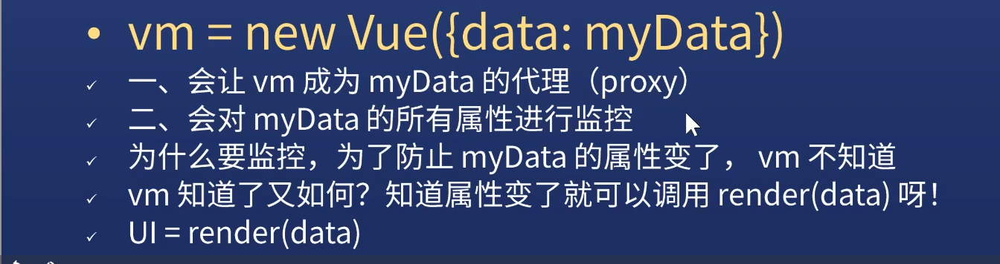
### computed 和 watch
* computed适用于动态计算data或props中的数据，需要加return，当数据无变化时会优先从缓存里读取，比较依赖缓存。
* watch是监听data或props中的数据变化，并且支持异步，当数据发生改变的时候，watch中的函数就会执行，有两个参数，前者是newVal，后者是oldVal。为了发现对象内部值的变化，需要进行深度监听，设置deep: true，但监听数组不需要这么做。
immediate:true 页面首次加载的时候做一次监听。
## 模板、指令与修饰符
* 表达式

```vue
1. {{object.a}} 表达式
2. {{n + 1}} 可以写任何运算
3. {{ fn(n) }} 可以调用函数
4. 如果值是 undefined 或 null  则不显示
5. 另一种写法为 <div v-te xt='表达式'> </div >
```

* HTML内容
```vue
1. 假设 data.x 值为 <strong> hi </strong>
2. <div v-html='x'></div> 即可显示粗体的 hi
* 我就想展示 {{ n }}
1. <div v-pre> {{ n }}</div>
2. v-pre 不会对模板进行编程
```
* 绑定属性
```vue
1. 
* v-bind:简写为：
1. <mg :src='x'/>
```
* 绑定对象
```vue
1. <div :style='{border:'1px solid red',height:100}'> </div> //注意这里可以把100px写成100，省略px，但不可以省略 em 
```
### 绑定事件
* v-on:事件名
```vue
1. <button v-on:click='add'>+1</button>
  点击之后，Vue会运行add()  // 会自动加括号
1. <button v-on:click='xxx(1)'> xxx </button>
  点击之后，Vue会运行xxx(1)
1. <button v-on:click='n+=1'> xxx </button>
  点击之后，Vue会运行n+=1
  就是发现函数就加括号调用之，否则就直接运行代码
  这导致一个问题，如xxx(1)返回一个函数咋办
  答：用Vue的人怎么可能先出这么复杂的用法
```

* 缩写
```vue
<button @click='add'>+1</button>
  比较常用 
```

## 条件判断
* if...else
```vue
<div v-if='x>0'>
x 大于 0 
</div>
<div v-else-if='x===0'>
x 为 0
</div>
<div v-else>
x 小于 0
</div>
```
## 循环
* for(value,key)in对象或数组  
```vue
<ul>
    <li v-for='(u,index) in users' :key='index'>
        索引:{{index}}  值:{{u.name}}
    </li>
</ul>
// 如果出现v-for，后面一定要接上key，否则控制台会有警告

<ul>
    <li v-for='(value,name) in obj' :key='name'>
        属性名:{{name}},属性值:{{value}}
    </li>
</ul>
```
## 指令
* 什么是指令
```vue
<div v-text='x'></div>
<div v-html='x'></div>
  以 v- 开头的东西就是指令
```
## 修饰符
* 有些指令支持修饰符
```vue
@click.stop='add' 表示阻止事件传播/冒泡
@click.prevent='add' 表示阻止默认动作
@click.stop.prevent='add'  同时表示两种意思
```
* .sync
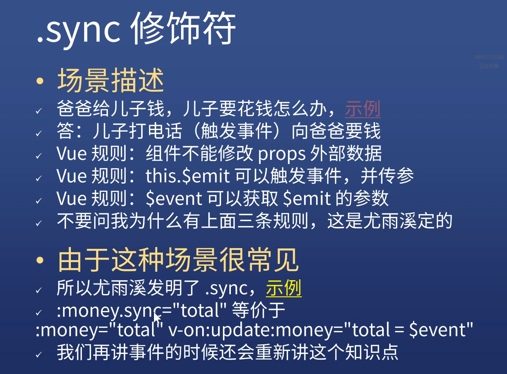
1. sync修饰符可以实现子组件与父组件的双向绑定，并且可以实现子组件同步修改父组件的值。一般情况下，想要实现父子组件间值的传递，通常使用的是props和自定义事件emit。其中，父组件通过props将值传给子组件，子组件再通过emit将值传给父组件，父组件通过事件监听获取子组件传过来的值。如果想要简化这里的代码，可以使用.sync修饰符，实际上就是一个语法糖。

## 进阶构造属性
### Directives指令
* 两种写法
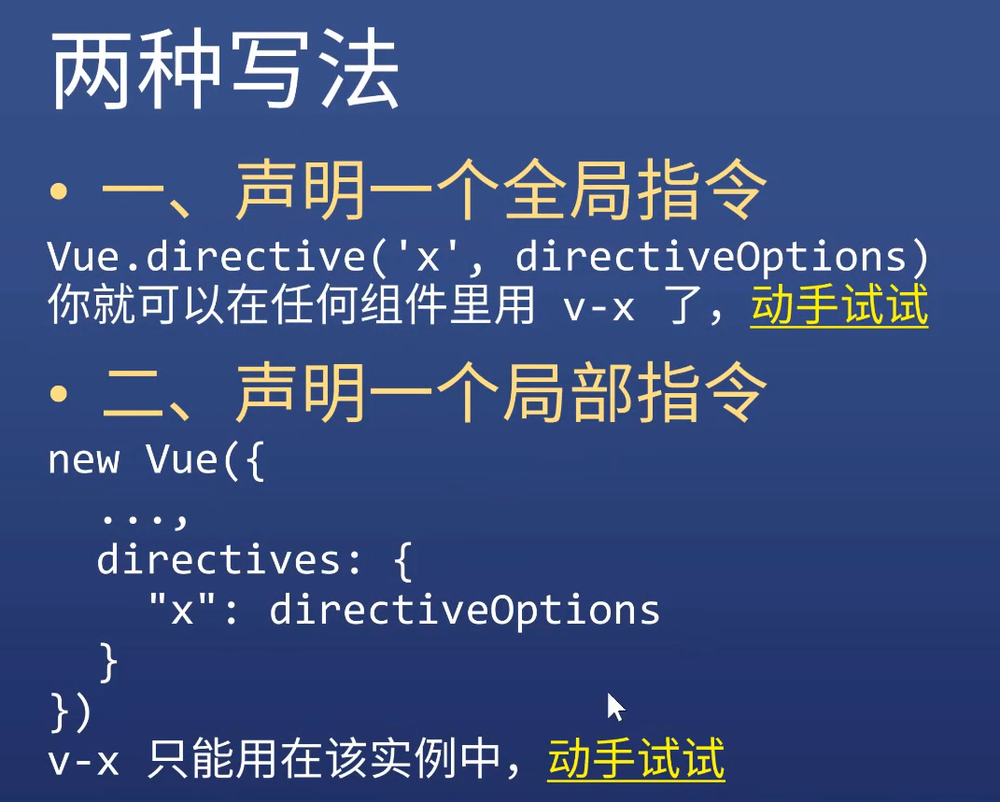

## 表单与v-model
* input输入框
1. 
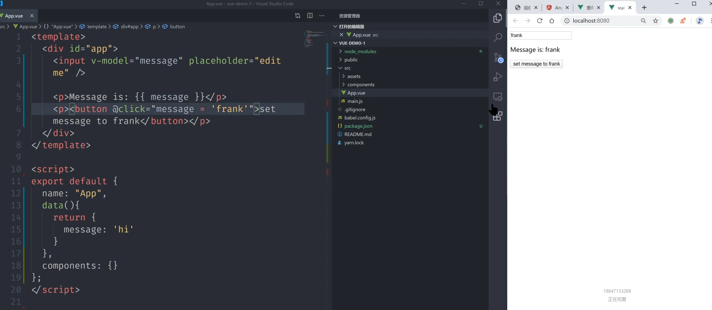
2. v-model='x',将内存绑定到页面中，同时也是把页面和内存绑定在了一起，更改内存会影响到页面，更改页面亦会影响到内存
* textarea
原理同上，只是输入框是一个多行样式
* 复选框
1. type=checkbox
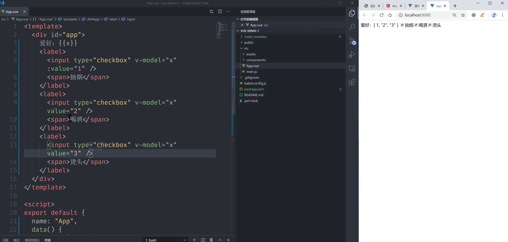
//在每一个复选框代码里写上input type=checkbox
2. 单选框type=radio
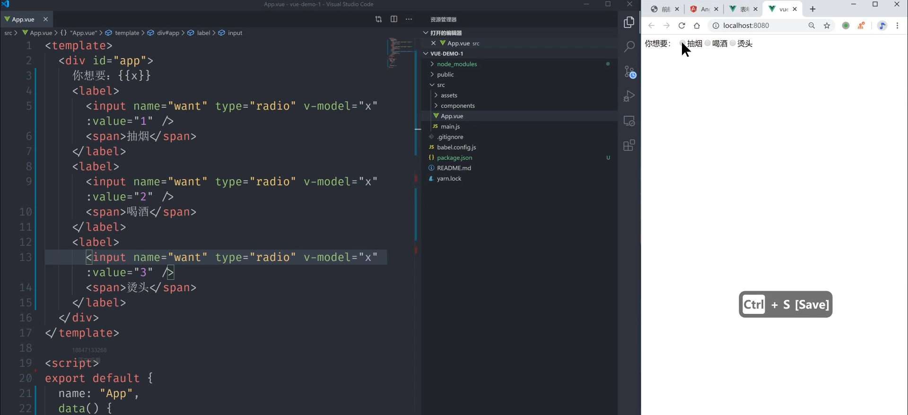
* select选择器
1. 
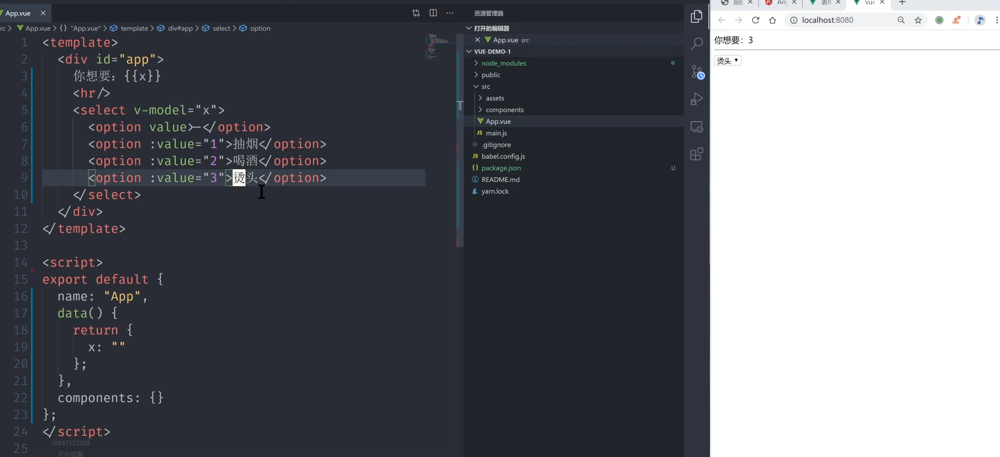
2. multiple 多选（用Ctrl加选）
* form表单（一般用于用户登录）
1. 登录（提交）按钮
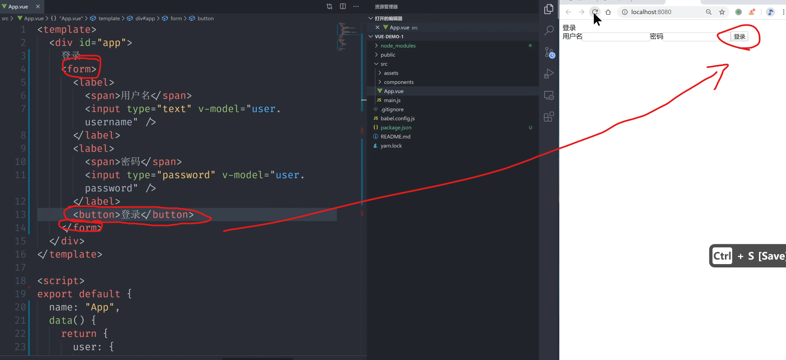
必须是form且有登录按钮才能进行登录刷新
2. submit.prevent  

```vue
<form @submit.prevent = 'onSubmit'>阻止提交的默认动作
<button type="submit>" 按钮的类型是提交
```
### 修饰符
* v-model.lazy
1. .lazy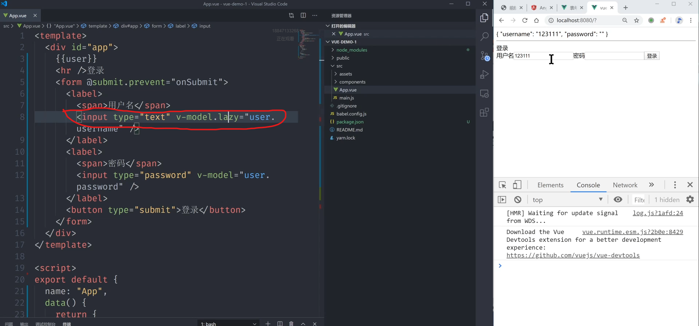
用来监听input事件，当鼠标选择input以外的东西时才会更新UI
2. input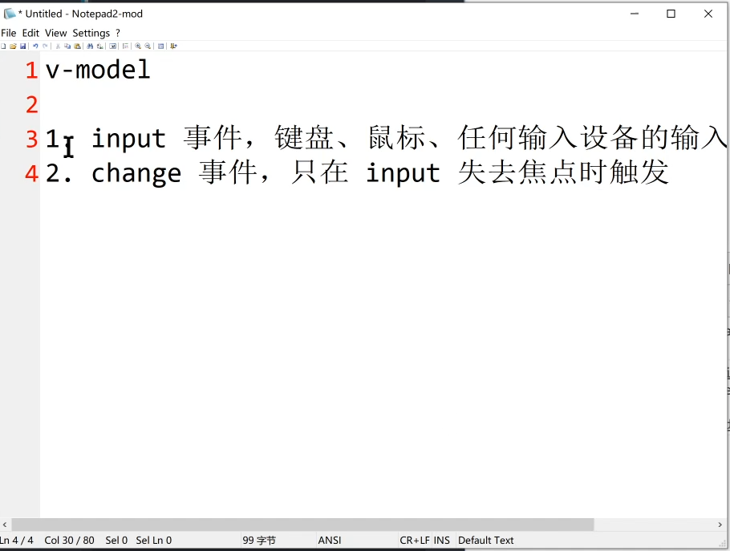
input是实时更新，change是移出焦点时更新UI
* v-model.number
1. .number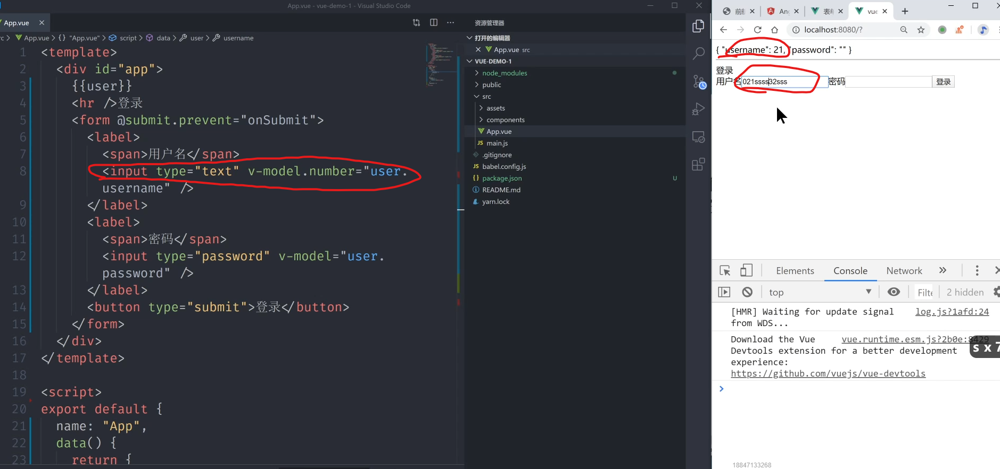
如果想要将数据处理成数字，可现在data中限制username为数字，然后在v-model后加.number，这样做会限制输入
* v-model.trim
1. 修剪空格 
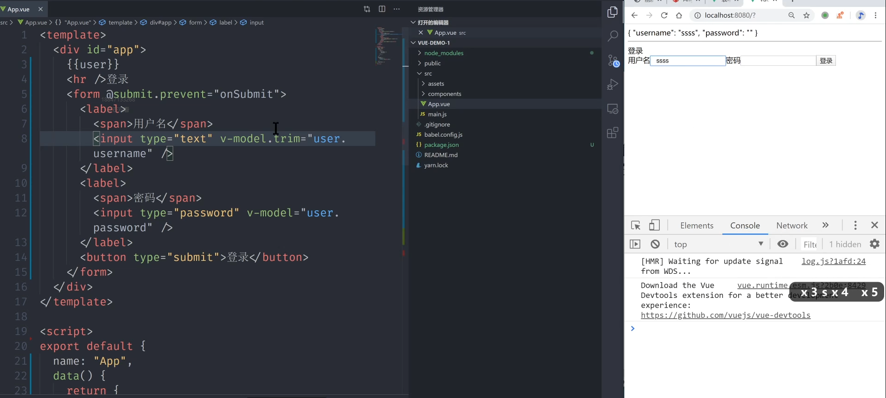
会将两头多余的空格进行修剪
## v-model
* v-model的等价写法
1. 
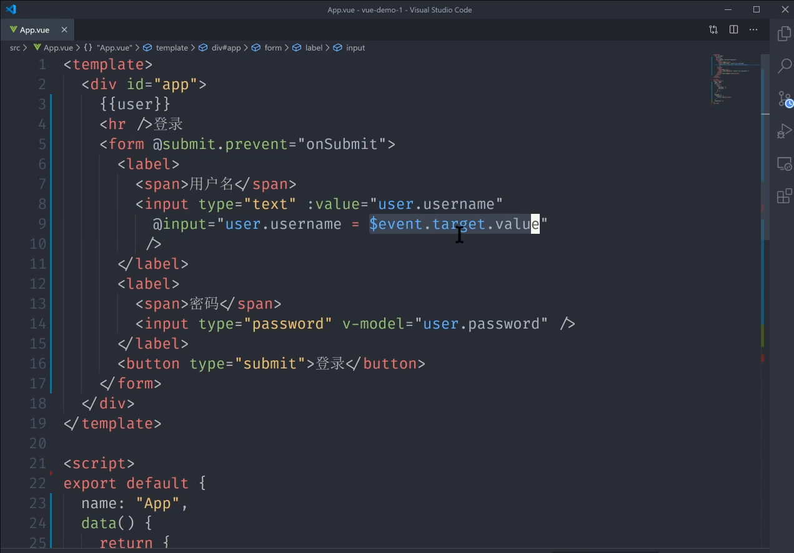