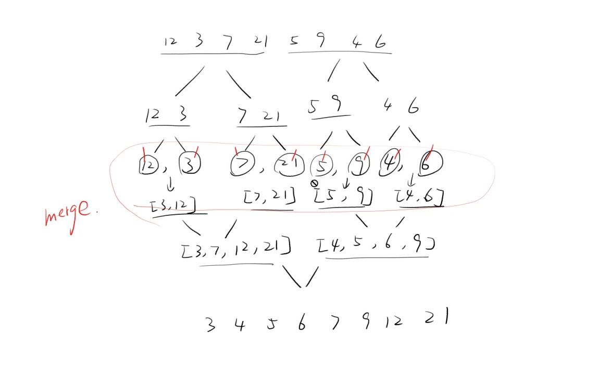
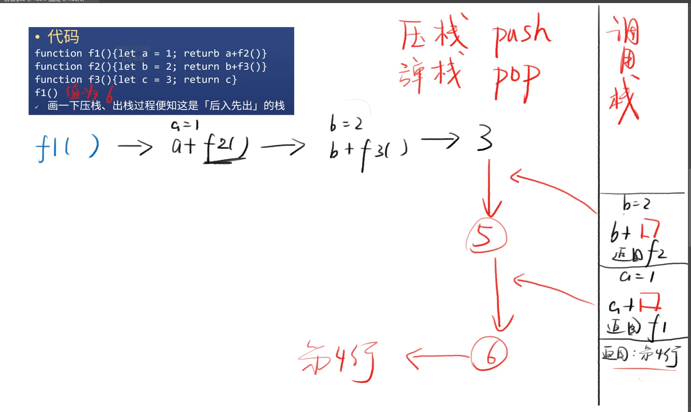

# 一：排序算法
## 内置API
* JS内置了Math.min（找出数组中最小的数字）
1. Math.min(1,2) //1
2. Math.min.call(null,1,2)
3. Math.min.apply(null,[1,2])


## 选择排序
```JavaScript
let swap =(array,i,j)=>{
    let temp = array[i]
    array[i] = array[j]
    array[j] = temp
}
```

```JavaScript
let minIdex = (numbers) =>{
    let index = 0
    for(let i=1;i< numbers.length;i++){
        if(numbers[i]< numbers[index]){
            index=1
        }
    }
    return index
}
```

```JavaScript
let sort = (numbers)=>{
    for(let i=0;i < numbers.length-1;i++){
        let index = minIndex(numbers.slice(i))+i // slice i 用来删除已经排序过的最小的数字，+i 用来恢复被改变的下标（下标被改变的原因：是因为数组中有数字已经被slice掉了，导致改变了原有下标）
        swap(numbers,index,i) // 括号内第一个参数写数组，第二个写数组中筛选出来的最小数字的下标，第三个参数写要替换的下标位置
    }
}
```
## 快速排序
```JavaScript
let quickSort = arr =>{
    if(arr.length<=1){return arr}
    let pivotIndex = Math.floor(arr.length / 2) //找到数组里向下取整的中心点的下标
    let pivot = arr.splice(pivotIndex,1)[0]// 将中心点下标的数字剔除出来作为基准点
    let left = []
    let right = []
    for (let i=0; i <arr.length;i++){ // 此时进行循环，就不会将基准点进行再次排序
        if(arr[i]< pivot){
            left.push(arr[i])
        }else{
            right.push(arr[i])
        }
    }
    return quickSort(left).concat([picot],quickSort(right))
}

```
## 归并排序
```JavaScript
let mergeSort = arr =>{
    let k =arr.length
    if(k===1){return arr}  // 如果数组里就只有一个，那么就返回这个数字
    let left = arr.slice(0,Math.floor(k/2))
    let right = arr.slice(Math.floor(k/2))
    return merge(mergeSort(left),mergeSort(right))
}
let merge = (a,b)=>{
    if(a.length===0)return b
    if(b.length===0)return a
    return a[0]>b[0] ?
        [b[0]].concat(merge(a,b.slice(1))) :
        [a[0]]concat(merge(a.slice(1),b))
}
```
###例图：

## 快速排序
* 思路：用一个哈希标做记录
* 发现数字N就记N:1，吐过再次发现N就加1
* 最后把哈希表的key全部打出来，假设N:m，那么N需要打印m次
```JavaScript
let countSort = arr =>{
    let hashTable = {},max = 0,result = []
    for(let i=0;i<arr.length;i++){ //遍历数组
        if(!(arr[i] in hashTable)){
            hashTable[i] = 1
        }else{
            hashTable[i] +=1
        }
        if(arr[i] > max){max=arr[i]}
    }
    for(let j=0;j<=max;j++){ // 遍历哈希表
        if(i in hashTable){
            for(let i=0;i<hashTable[j];i++){
                result.push(j)
            }
        }
    }
    return result
}
```


# 二：数据结构
* 举例
1. JS函数的调用栈call stack 就是一个栈
2. 假设f1 调用了f2，f2又调用了f3
3. 那么f3结束后应该回到f2，f2结束后应该回到f1
```javascript
function f1(){let a = 1; returb a+f2()}
function f2(){let b = 2; return b+f3()}
function f3(){let c = 3; return c}
f1()
```
